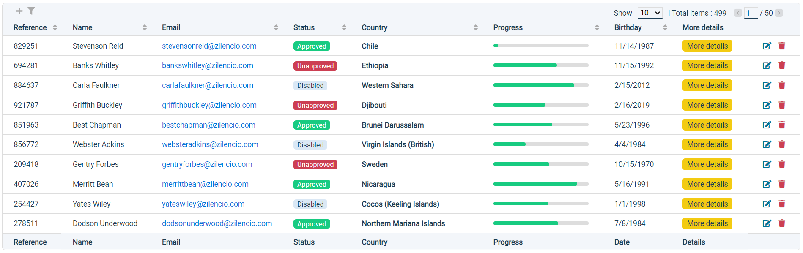

# K-Datatable Package

K-datatable is an Angular package that allows you to display your JSON data in an HTML table and edit, filter, sort or display it in many pages.

## Demo

<a href="http://localhost:4200/">Stackblitz</a>



## Install

To install this library with npm, run below command:

`npm k-datatable`

Then import KDatatableModule module in your app.module.ts

```ts
import { KDatatableModule } from 'k-datatable';

@NgModule({
  declarations: [
    ...
  ],
  imports: [
    ...
    KDatatableModule,
    ...
  ],
  providers: [],
  bootstrap: [AppComponent]
})
export class AppModule { }

```

Setup your component as below :

First prepare your data in your component TS file

```ts
import { Component, OnInit } from '@angular/core';

@Component({
  selector: 'app-root',
  templateUrl: './app.component.html',
  styleUrls: ['./app.component.scss']
})

export class AppComponent implements OnInit {
  
  // Your JSON data
  jsonData = [
    {
        "id": "619789b2fa489d7014d5c263",
        "reference": 829251,
        "name": "Stevenson Reid",
        "createdAt": "Sat Nov 14 1987 10:55:59 GMT+0100 (UTC+01:00)"
    },
    {
        "id": "619789b2e138b5f384b8277e",
        "reference": 694281,
        "name": "Banks Whitley",
        "createdAt": "Sun Nov 15 1992 12:42:53 GMT+0100 (UTC+01:00)"
    },
    {
        "id": "619789b2d5bdffbb30b1ef82",
        "reference": 884637,
        "name": "Carla Faulkner",
        "createdAt": "Wed Feb 15 2012 14:27:52 GMT+0100 (UTC+01:00)"
    }
  ]
  
  // Initialize data table data
  data = {
    addItem: true,
    header: [
      {
        name: "Reference",
        type: "number",
        sort: true,
        filter: false
      },
      {
        name: "Name",
        type: "text",
        sort: false,
        filter: true
      },
      {
        name: "Created at",
        type: "date",
        sort: true,
        filter: true
      },
      {
        type: "buttons",
        sort: false,
        filter: false
      }
    ],
    footer: ["Reference", "Name", "Created at", ""],
    items: new Array()
  }

  constructor() { }

  ngOnInit(): void {
    // Initialize data table with your json data
    for (let i of this.jsonData) {
      this.data.items.push({
        inputData: item,
        data: [
          {
            content: item?.reference,
          },
          {
            content: item?.name
          },
          {
            content: {
              value: new Date(item?.createdAt).toLocaleDateString("en-En"),
              date: new Date(item?.createdAt)
            }
          },
          {
            content: [
              {
                title: "Update",
                event: "update"
              },
              {
                title: "Delete",
                event: "delete"
              }
            ]
          }
        ]
      })
    }
    
  }
  
  // Declare your data table event function
  event(event: any) {
    switch (event?.name) {
      case 'add':
        //add a new item to your json object
        break;
      case 'update':
        // update an item from your json object
        // use event?.outputData to get item data
        break;
      case 'delete':
        // delete an item from your json object
        // use event?.outputData to get item data
        break;
    }
  }

}
```

Then add ```<k-datatable>``` component to your component HTML file
  
```html
<k-datatable [data]="data" (event)="event($event)"></k-datatable>
```

## Options

### Data options

Option | Description | Values | Default value
--- | --- | --- | ---
translation | Text fields translation | See the 'translation' section | { }
style | CSS style of table |  See the 'style' section | { }
view | Showed items options |  See the 'view' section | { }
addItem | Add items option | Boolean | false
header | Table header options | See the 'header' section | [ ]
footer | Name of columns in table footer | Array of String | [ ]
items | Table rows | Array of item options (see the 'items' section) | [ ]

#### translation

Option | Description | Values | Default value
--- | --- | --- | ---
add | Add button title | String | Add
filter | Filter button title | String | Filter
allItems | All items select option text | String | All
totalItems | Total number of items text | String | Total items
show | Show items select field text | String | Show


#### style

Option | Description | Values | Default value
--- | --- | --- | ---
width | Table width | Number (pixels) or 'full' (100%) | auto
height | Table width | Number (pixels) or 'full' (100vh) | auto
overflowX | Horizontal overflow | String (CSS overflow options) | auto
overflowY | Vertical overflow | String (CSS overflow options) | auto
stickyHeader | Header sticky position | Boolean | false
stickyFooter | Footer sticky position | Boolean | false
textAlign | Text alignment | String (CSS text-align options) | left

#### view

Option | Description | Values | Default value
--- | --- | --- | ---
itemsPerPage | Number of showed items per page | Number | 10
showedItems | Number of showed items per page select options | Array of Number | [10, 20, 30, 50, 100]

### Header options
Option | Description | Values | Default value
--- | --- | --- | ---
name | Name of column | String | Empty
type | Type of column data | Enumerate | ['number', 'text', 'bold', 'badge', 'date', 'email', 'link', 'progress', 'image', 'buttons', 'mini-buttons']
filter | Apply filter in column | Boolean | false
sort | Sort data by column data | Boolean | false
width | Column width | Number (pixels) | auto

### Items options
Option | Description | Values
--- | --- | ---
inputData | Input data that will be retrieved in variable outputData when an event is triggered from data table. | Any
data | Data table rows data | Array of item (see the 'item' json object section)

#### item

```ts
// for number, text, bold, badge, email or progress column type
{ 
  content: string, // Cell value
  styleClass: string // Your CSS class or K-Datatable CSS class
}

// for date column type
{
  content: {
    value: string, // Displayed value of the date
    date: Date // Date value
  },
  styleClass: string
}

// for link column type
{
  content: {
    value: string, // Displayed value of the link
    url: Date // url value
  },
  styleClass: string
}

// for image column type
{
  content: {
    src: string, // Url of the image
    width: number, // Image width (pixels)
    height: number, // Image height (pixels)
    alt: string, // Image alternative attribute
  },
  styleClass: string
}

// for buttons or mini-buttons column type
{
  content: [
    {
      title: string, // Button title
      event: string, // Name of the event that will be triggered by clicking on the button
      styleClass: string
    }
  ]
}
```

## CSS classes

Class | Description
--- | ---
k-color-colorValue | Color
k-bg-colorValue | Background color
k-border-colorValue | Border color

### Color values

-  primary 
-  success
-  warning
-  danger
-  dark
-  light

## Custom CSS classes

You can define your own CSS classes and use them in the styleClass parameter. In some cases custom classes require the use of ` ::ng-deep ` and ` !important ` options.

## npmjs

<a href="https://www.npmjs.com/package/k-datatable" target="_blank">npmjs</a>
